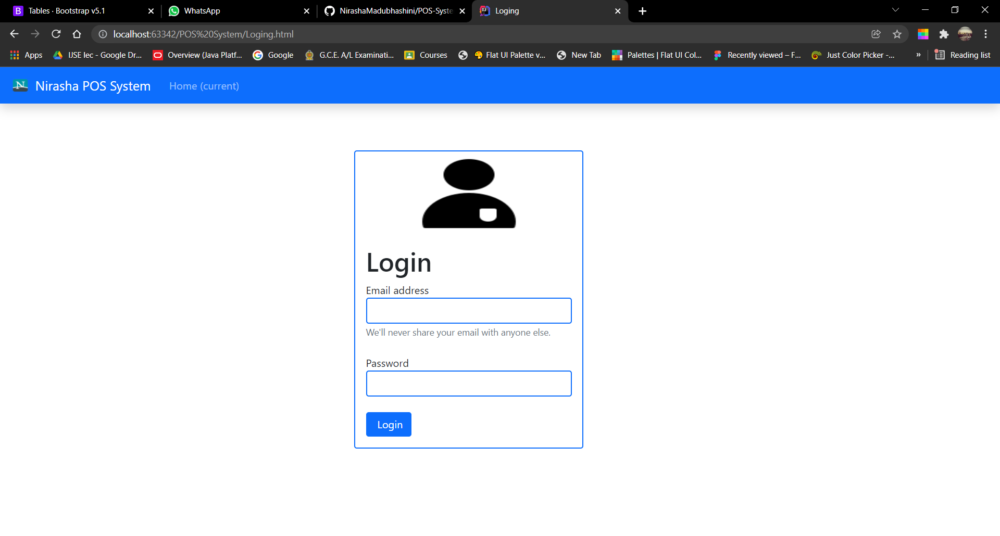
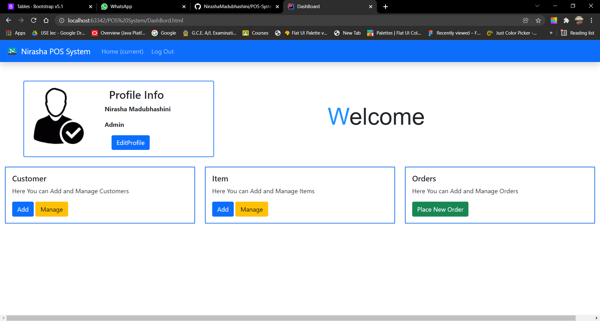
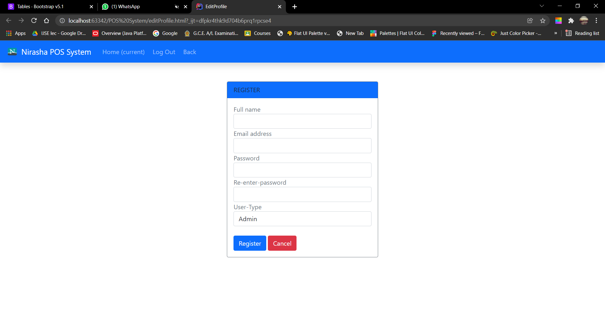
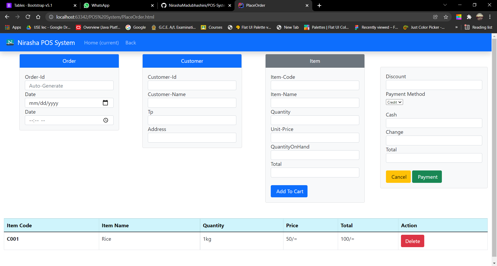
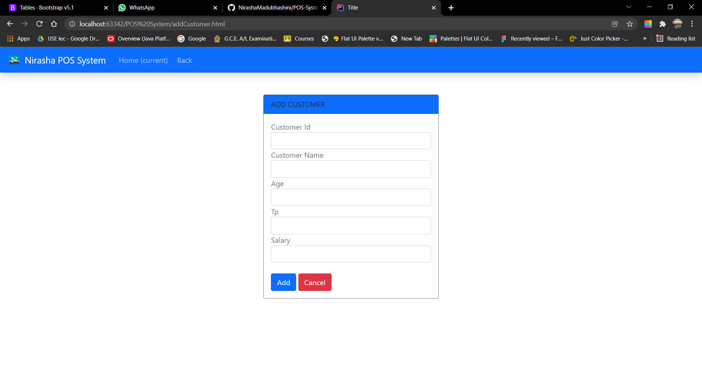
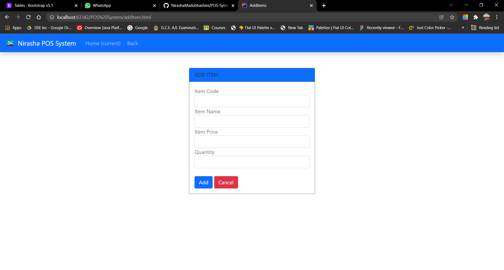

<<<<<<< HEAD
=======

>>>>>>> 745d0f5269fb8fc85d29a0428e31676a00eb4f3c
This is my very first project made by using CSS FrameWorks. 
There are some links that I use to make this SPA System.

Site map = https://www.gloomaps.com/wTmcN9yMAT

Wire frame = https://wireframe.cc/UhVcqN

Mock up= https://www.figma.com/file/mIt7M0c6mPgkxm8hQuIhwp/Untitled?node-id=0%3A1

github = https://github.com/NirashaMadubhashini

##Screenshots of SPA System##

01.Loging

02.DashBoard

03.EditProfile

<<<<<<< HEAD
04.ManageCustomers

05.ManageItems

06.PlaceOrder

=======
04.AddCustomer

05.AddItem

06.ManageCustomers

07.ManageItems

08.PlaceOrder

